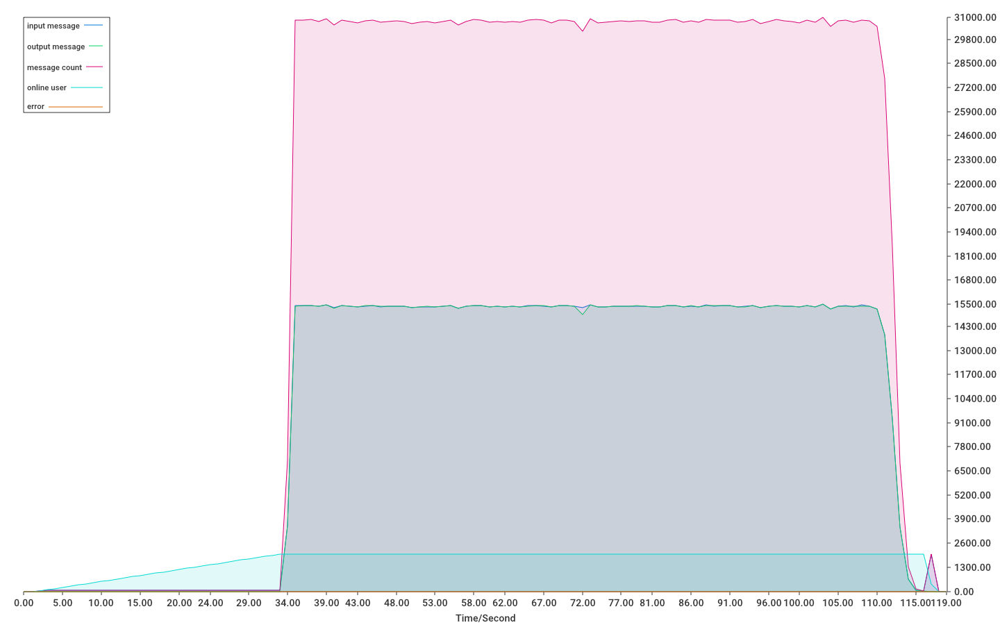

# Glide-IM


[](https://goreportcard.com/report/github.com/dengzii/go_im)

一款高可靠, 高性能的 IM 服务, 支持分布式集群部署, 单机(单实例)部署.

[前端示例项目源码](https://github.com/fly-im/im_web)

**功能**

- 群聊, 一对一聊天
- 群管理
- 联系人管理
- 多设备登录, 消息同步
- 离线消息
- 消息历史, 同步

**进行中**

* [ ] 分布式部署(已完成,优化中)
* [ ] 客服聊天

## SDK

计划中...

## 讨论群

QQ群: 793204140

## 性能测试

单机性能测试

1. 启动服务器

```shell
go test -v -run=TestServerPerf
```

2. 开始用户模拟

```shell
go test -v -run=TestRunClient
```

### 测试环境

```
Windows 10
AMD R5 3600 6核12线程 
16GB 内存
100Mbps 网卡
```

一台机器做服务器, 一台模拟客户端并运行MySQL数据库

同时模拟 2000 客户端, 每间隔 60ms-200ms 发送一条消息, 共发送 600 条消息,

网卡负载 90%, 每秒约 30_000 条消息吞吐量, 上下行各 15k 条, 送达率 100%, 消息延时<=20ms



## 特别鸣谢


## License

参见 [LICENSE](LICENSE)