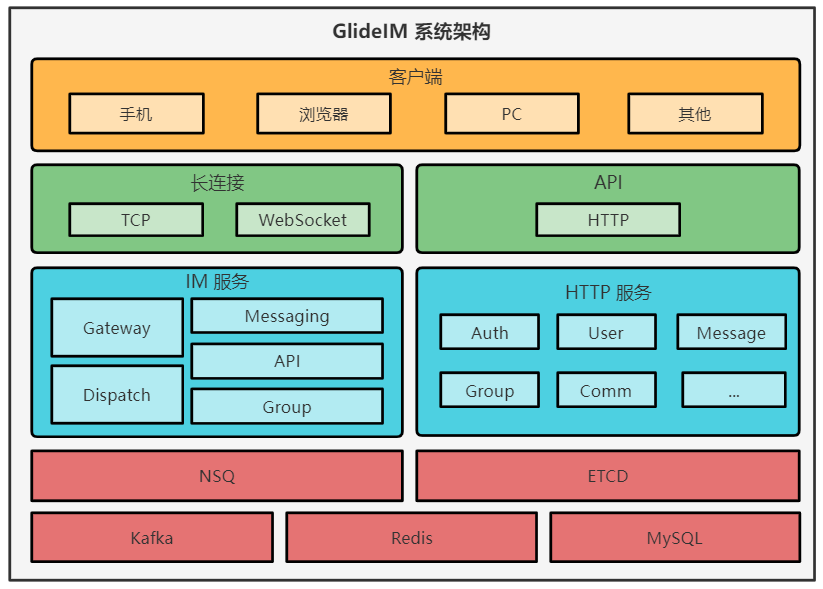

# Glide-IM


[](https://goreportcard.com/report/github.com/dengzii/go_im)

一款高可靠, 高性能的 IM 服务, 支持分布式集群部署, 单机(单实例)部署.

## 简介

GlideIM 是一款完全开源的 IM 服务, 支持单实例, 微服务等多种方式部署. 支持 WebSocket, TCP 两种连接协议, 内置 JSON, ProtoBuff 两种消息交换协议, 并支持添加协议解析过程, 消息加密等.
GlideIM 还实现了智能心跳保活机制, 死链接检测, 消息 ACK 机制等功能.

### 立即体验

[安卓体验 APP 下载](https://github.com/Glide-IM/Glide-IM-Android/releases)

[GlideIM Web (TODO)](https://github.com/Glide-IM/Glide-IM-Web)

## 相关仓库

[前端示例项目源码](https://github.com/Glide-IM/im_web)

[Android 端示例项目源码及 SDK](https://github.com/Glide-IM/Glide-IM-Android)

[Java SDK](https://github.com/Glide-IM/Glide-IM-Java-SDK)

## 项目构建

### 环境依赖

#### 单实例模式

- Redis
- MySQL

#### 分布式模式

- ETCD: `./cmd/script/etcd`
- NSQ: `./cmd/script/nsq`

### 入口

目录 `./cmd/run` 下为不同模式下的入口, 目录名即为服务/模式

- 分布式相关入口
    - api_rpc API 服务
    - dispatch 消息分发服务
    - gateway 用户连接, 网关服务
    - group 群聊服务
    - messaging 消息路由服务
- HTTP API
    - api_http 通过 HTTP 服务访问 API 接口
- 单实例运行
    - singleton

### 编译 .proto

项目中提交的 `/protobuf/gen` 目录就是已经编译好的 go 源码.

```shell
/protobuf/compile.sh
```

### 单实例运行

为了方便调试, 部分情况下只需要单实例运行即可, 例如调试客户端, 消息收发流程, 分布式部署的调试要部署整个流程是比较麻烦的, 所以一般是每个服务单独调试.

```shell
go run ./cmd/run/singleton/main.go
```

### 单实例可执行文件运行

如果觉得编译麻烦, 或者依赖出问题, 这里有编译好的.

这个是已经编译好的 Linux x64 环境下的单例模式可执行文件, 只需要在配置文件中改一下数据库相关即可运行.

Windows 环境在 [Releases](https://github.com/Glide-IM/Glide-IM/releases) 中下载即可.

```shell
wget https://raw.githubusercontent.com/Glide-IM/Glide-IM/master/cmd/script/glide_im/fast_deploy.sh && chmod +x fast_deploy.sh && ./fast_deploy.sh 
```

## 性能

单机支持约 20w(4万消息吞吐量) 活跃用户同时聊天(100Mbps), [查看测试数据](https://github.com/Glide-IM/Glide-IM/blob/master/doc/performance_test.md)

## 系统架构

介绍文章: [GlideIM - Golang 实现的高性能的分布式 IM](https://github.com/Glide-IM/Glide-IM/blob/master/doc/arch.md)



## 讨论群

[](https://qm.qq.com/cgi-bin/qm/qr?k=PJvSdCQXtAXyBGuOyP-T2CPu9eVNmzls&jump_from=webapi)

- 微信群


## 特别鸣谢

[]( https://jb.gg/OpenSourceSupport)

## License

参见 [LICENSE](LICENSE)
