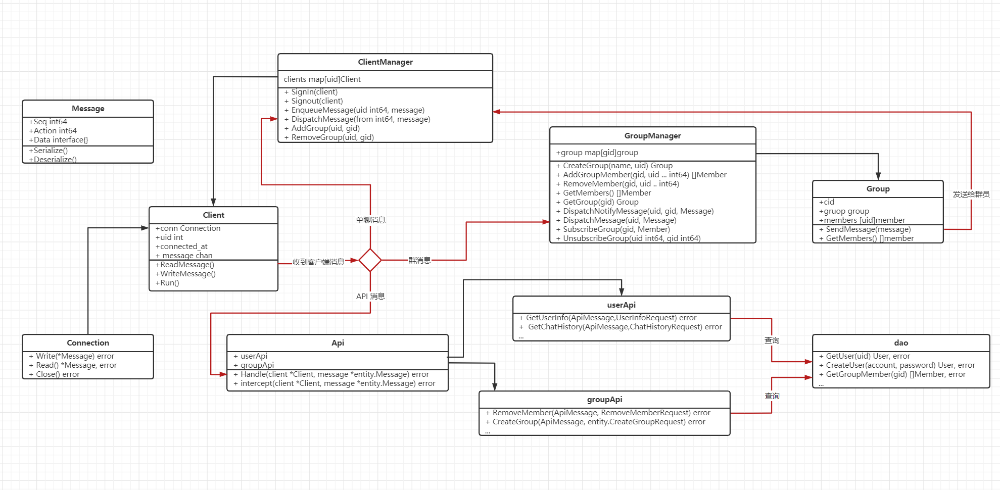

## 主要对象

### 1. Connection (代表一个长连接)

表示一个 *网络* 长连接, tcp 或 websocket 等, 负责对数据包的序列化, 读写, 及异常处理

0. 长连接作为 IM 的核心之一, 是数据的出入口, 有必要独立成单独的对象
1. 抽象一个长连接, 屏蔽 TCP 或 WebSocket 等其他实现的具体实现细节
2. 避免不同长连接接口的差异导由长连接持有者管理, 导致代码混乱

### 2. Client (代表一个用户连接/客户端)

表示一个 *客户端* 连接, 负责收发客户端消息, 维护管理用户的状态, 信息等

0. 用户连接, 登录状态管理
1. 读取 Connection 中的消息, 将数据包交给相应的处理者处理, 处理异常的消息
2. 向 Connection 写入用户消息 chan 中的消息 

### 3. Api (除即时聊天消息外的查询接口)

表示 API 接口, 负责处理所有客户端查询请求, 例如注册登录, 关系管理, 历史记录等

0. 用户相关查询接口 userApi, 群相关查询接口 groupApi
1. 从 dao 中增删改查数据, 把结果发送给相关联的客户端

### 4.ClientManager (管理所有客户端)

负责管理所有客户端连接, 

## 5. GroupManager
