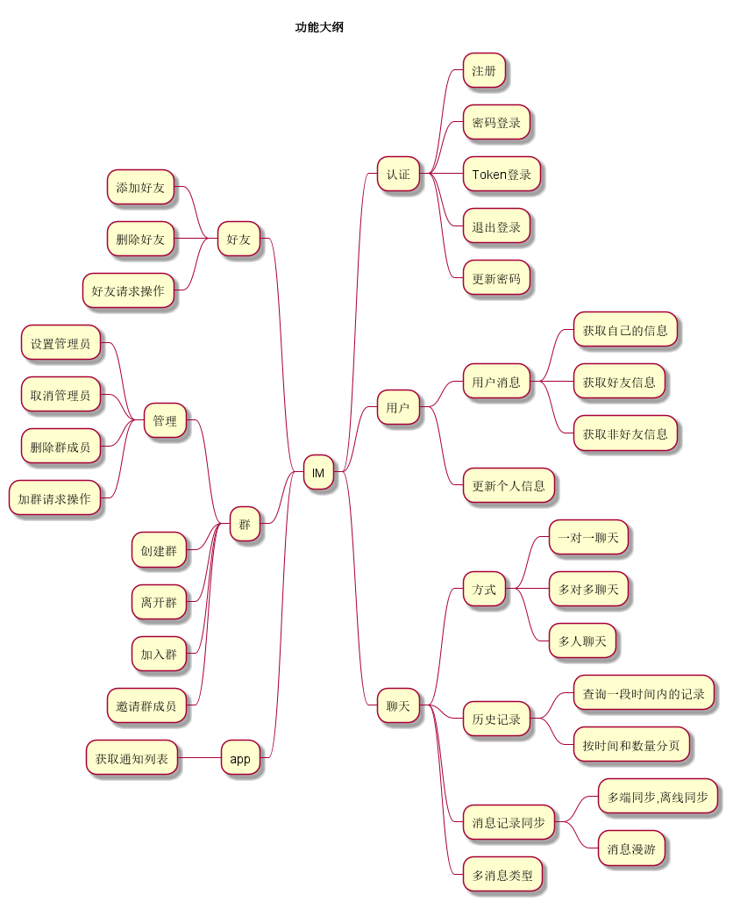
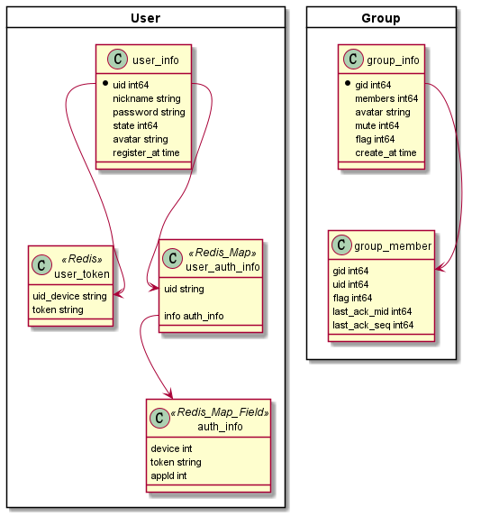
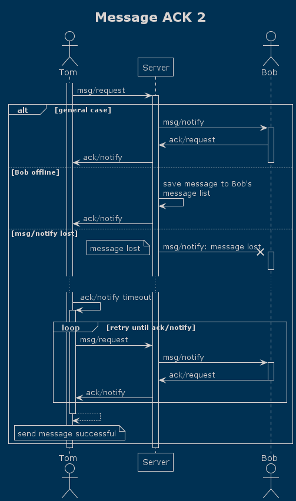
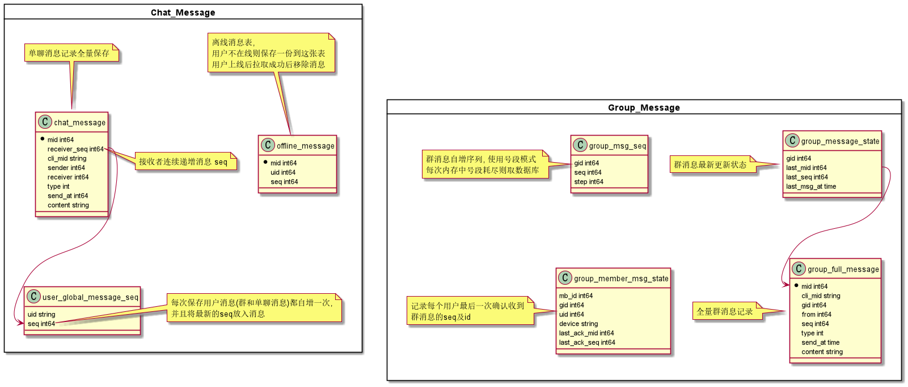
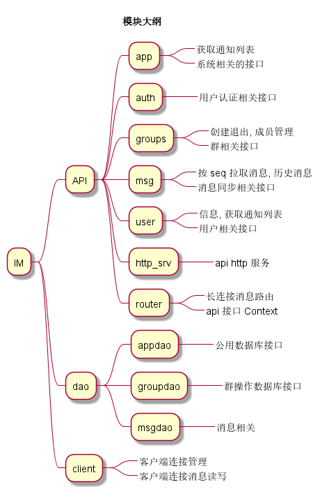
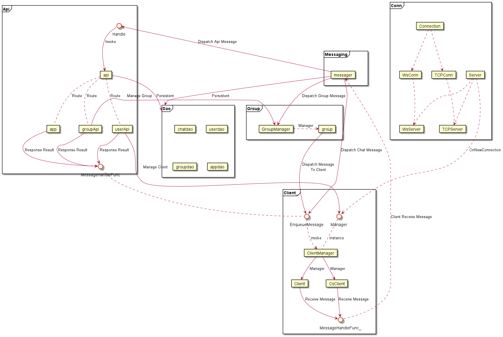
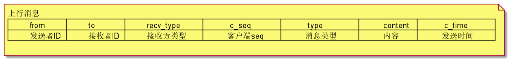

- [用户功能大纲](img/user_feature.png)
- [群, 用户表定义](img/group_user_db_model.png)
- [消息确认机制(ACK)](img/message_ack.png)
- [消息相关数据库表定义](img/message_db_model.png)
- [项目包简单描述](img/module_outline.png)
- [模块关系图](img/project_structure.png)
- [上行消息定义](img/up_message.png)

